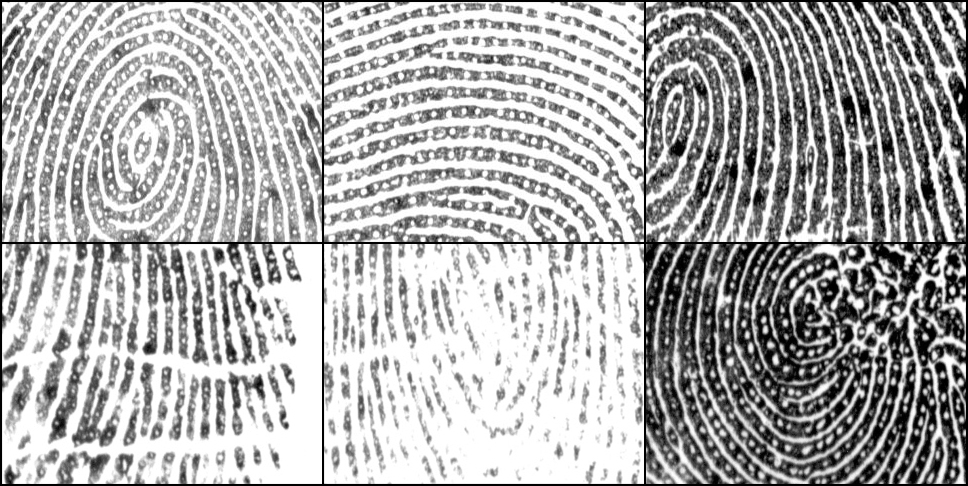

# Dataset Description

## IITI-HRF
- The IITI-HRF high-resolution fingerprint dataset contains fingerprint images of 100 subjects. It contains fingerprint images of 8 fingers (all fingers except the little fingers of both hands), each contributing eight impressions.
- These images are captured using the commercially available Biometrika HiScan-Pro fingerprint scanner. This scanner captures a fingerprint image of size 1000×1000 pixels.
- Our dataset, which contains 6400 (100×8×8) fingerprint images of size 1000×1000 pixels, is referred to as IITI-HRFC.
- Further, we have created a partial fingerprint image dataset (referred to as IITI-HRFP) by cropping a rectangular region of size 320×240 pixels around the center of each image in IITI-HRFC.
- We have also generated ground truth pore data for 20 fingerprints (belonging to 20 unique fingers) selected randomly from IITI-HRFP. These fingerprint images and their corresponding ground truth pore coordinates are collectively referred to as IITI-HRFP-GT.
- The dataset has been slipt into train and test set with 80-20 ratio.

## IITI-HRF Extended
- IITI-HRF Extended (IITI-HRF-E) dataset extends the IITI-HRF dataset by adding fingerprint images of 49 new subjects (3136 images).
- Same procedure was used to gather the addtional data.
- Similar to IITI-HRF, IITI-HRF-E has two variants, i.e, IITI-HRFP-E and IITI-HRFC-E.
- The dataset has been slipt into a train and test set with an 80-20 ratio.

# Summary

| Dataset     | Resolution (dpi) | Image Size (pixels) | Fingers | Total Images | Training Images | Testing Images |
|-------------|------------------|---------------------|---------|--------------|-----------------|----------------|
| IITI-HRFP   | 1000             | 320x240             | 800     | 6400         | 5120            | 1280           |
| IITI-HRFC   | 1000             | 1000x1000           | 800     | 6400         | 5120            | 1280           |
| IITI-HRFP-E | 1000             | 320x240             | 1184    | 9536         | 7624            | 1912           |
| IITI-HRFC-E | 1000             | 1000x1000           | 1184    | 9536         | 7624            | 1912           |

# IITI-HRF Dataset Download
[Fill out the form to download the IITI-HRF dataset](https://forms.gle/GZhvBvYGJQgtfifN8)

# Authors

- A. Nema
- V. Anand
- V. Kanhangad

# Citing

```bibtex
@article{anand2020porenet,
  title={PoreNet: CNN-based pore descriptor for high-resolution fingerprint recognition},
  author={Anand, Vijay and Kanhangad, Vivek},
  journal={IEEE Sensors Journal},
  volume={20},
  number={16},
  pages={9305--9313},
  year={2020},
  publisher={IEEE}
}

@article{anand2020unsupervised,
  author={Anand, Vijay and Kanhangad, Vivek},
  journal={IEEE Sensors Journal}, 
  title={Cross-Sensor Pore Detection in High-Resolution Fingerprint Images}, 
  year={2022},
  volume={22},
  number={1},
  pages={555-564},
  publisher={IEEE}
}
```
